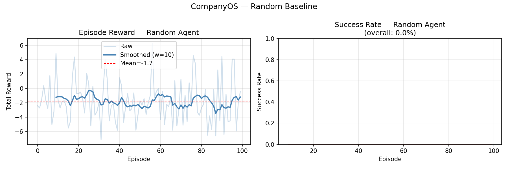

# 🏢 CompanyOS: Training AI Agents to Navigate Enterprise Chaos

*A fully open, OpenEnv-compliant RL environment for enterprise workflow reasoning*

---

## The Problem Nobody Talks About

Everyone is building AI agents. Most of them fail the moment they touch a real enterprise system.

Not because they're not smart enough — but because real enterprise systems are **messy in ways that toy benchmarks never capture**:

- A ticket exists but the priority field is `null`
- The compliance score you need is 4 days stale
- The CFO who needs to approve is out of office — and nobody told the system
- You submit the approval anyway and it gets randomly rejected
- You try to close the ticket and find out it's been blocked for 3 days

This is Tuesday morning for any enterprise employee. And it's exactly the kind of environment that breaks AI agents.

We built **CompanyOS** to fix this.

---

## What is CompanyOS?

CompanyOS is an **OpenEnv-compliant reinforcement learning environment** that simulates a partially observable enterprise. An agent must complete multi-step business workflows across three interconnected mock applications — navigating real enterprise chaos along the way.

It's live right now on HuggingFace Spaces. You can call it from anywhere:

```python
import requests

ENV = "https://satyamshahi-companyos.hf.space"

# Start an episode
obs = requests.post(f"{ENV}/reset").json()["observation"]
print(obs["task"])
# → "Complete vendor onboarding for ACME Corp. Verify the ticket,
#    check compliance data, and submit CFO approval."

# Take a step
result = requests.post(f"{ENV}/step", json={
    "app": "ticketdesk",
    "method": "list_tickets",
    "params": {}
}).json()

print(result["reward"], result["done"])
```

That's it. Any agent, any language, any framework — five lines to start interacting with the environment.

---

## Why OpenEnv?

OpenEnv is Meta's standard interface for RL environments. If you've used OpenAI Gym, the concept is identical — but designed specifically for the modern LLM agent era.

The interface is three methods:

```python
obs  = env.reset()                    # start a new episode
obs, reward, done, info = env.step(action)  # take one action
snapshot = env.render()               # inspect current state
```

### Why this matters

**Standardisation** — any training framework that supports OpenEnv works with your environment out of the box. No custom wrappers. No glue code.

**Reproducibility** — `env.reset(seed=42)` gives you the exact same episode every time. Essential for debugging and evaluation.

**Separation of concerns** — the environment and the agent are completely decoupled. Swap the agent (GPT-4 → Llama → your custom model) without touching the env. Swap the env without touching the agent.

**REST API deployment** — CompanyOS wraps OpenEnv in a FastAPI server, making the environment callable over HTTP. This means your training loop can run anywhere — Colab, HF Jobs, your laptop — while the environment runs on HF Spaces.

```
┌──────────────────┐         HTTP          ┌──────────────────┐
│   Training Loop  │  ←→  POST /step  ←→  │   HF Spaces Env  │
│  (Colab / HF Jobs│                       │  (OpenEnv + FastAPI│
└──────────────────┘                       └──────────────────┘
```

---

## The Three Apps

CompanyOS simulates three enterprise applications. The agent interacts with all three to complete each task.

### 🗂️ TicketDesk — The Jira-like Task System

```python
# What the agent sees
{
  "id": "T-001",
  "title": "Onboard vendor ACME Corp",
  "status": "open",
  "priority": null,        # intentionally missing
  "assignee": "unknown",   # intentionally missing
  "verified": False        # must be True before approval
}
```

**Chaos injected:** missing priorities, blocked statuses, unknown assignees, business rules that enforce ordering (can't link an approval without verifying first).

### 📊 DataHub — The Internal Analytics Warehouse

```python
# What the agent gets when querying stale data
{
  "metric_name": "vendor_compliance_score",
  "value": 72,
  "is_stale": True,
  "warning": "Data is 4 days old. Call refresh_data() before using."
}

# After refresh
{
  "metric_name": "vendor_compliance_score", 
  "value": 85,   # ← updated value surfaces after refresh
  "is_stale": False
}
```

**Chaos injected:** stale metrics that must be refreshed, values that change after refresh, OOO approver directory.

### ✅ ApprovalFlow — The HR/Finance Approval System

```python
# Trying to use the OOO CFO
{
  "error": "Approver sarah.chen (CFO) is OOO.",
  "hint": "Route to CFO_DELEGATE: david.kim instead."
}

# After correct submission
{
  "success": True,
  "approval_id": "APR-001",
  "message": "Submitted. Poll check_status() to track progress."
}
```

**Chaos injected:** OOO approvers, missing required data fields, random rejection rate, approval requests that require polling.

---

## How the Agent Interacts

Each step, the agent receives an observation and must output a JSON action:

```python
# Observation
{
  "task": "Complete vendor onboarding for ACME Corp",
  "step": 4,
  "max_steps": 20,
  "progress": {
    "ticket_priority_set": True,
    "ticket_verified": False,        # ← next goal
    "metric_refreshed": False,
    "approval_submitted": False,
    "approval_approved": False
  },
  "last_result": {"success": True, "updated": {"priority": "high"}},
  "tools": { ... }
}

# Action
{
  "app": "ticketdesk",
  "method": "update_ticket",
  "params": {"ticket_id": "T-001", "field": "verified", "value": True}
}
```

The agent has **9 tools** across the three apps. It must figure out the correct order to call them — the environment enforces business rules that prevent shortcuts.

### A successful episode trace

```
Step 1:  get_ticket(T-001)                    → sees priority=null, verified=False
Step 2:  update_ticket(priority, "high")      → reward: +1.0  ✅
Step 3:  update_ticket(verified, True)        → reward: +1.5  ✅
Step 4:  query_metric(compliance_score)       → WARNING: stale data
Step 5:  refresh_data(compliance_score)       → reward: +1.0  ✅
Step 6:  query_metric(compliance_score)       → value=85, fresh  ✅
Step 7:  get_approver(CFO)                    → CFO is OOO, use delegate
Step 8:  submit_approval(vendor_onboarding, david.kim, {...})  → reward: +2.0  ✅
Step 9:  check_status(APR-001)                → pending
Step 10: check_status(APR-001)                → approved → reward: +18.0  🎉
```

---

## The Reward System

CompanyOS uses shaped rewards to create a dense learning signal — the agent gets feedback every step, not just at the end.

| Action | Reward |
|---|---|
| Set missing ticket priority | +1.0 |
| Verify a ticket | +1.5 |
| Unblock a blocked ticket | +1.0 |
| Refresh stale metric | +1.0 |
| Query fresh data | +0.5 |
| Submit valid approval | +2.0 |
| Approval gets approved | +3.0 |
| **Task complete (terminal)** | **+15.0** |
| Failed API call | -0.3 |
| Invalid action | -1.0 |
| Per step (time pressure) | -0.1 |
| Timeout | -5.0 |

The terminal bonus of +15.0 is only awarded when **all progress flags are True** — you cannot skip steps to get it.

---

## Reward Hacking Prevention

This is where most RL environments fail. The model finds a shortcut that maximises reward without solving the real task. We spent serious time on this.

### Causal progress ordering

Progress flags enforce a strict dependency chain:

```
ticket_priority_set
        ↓
ticket_verified  ←── also requires metric_queried or metric_refreshed
        ↓
approval_submitted
        ↓
approval_approved
```

Trying to submit an approval without verifying the ticket? `approval_submitted` stays `False`. No reward. No shortcut.

### Stale data detection

Querying stale data does **not** satisfy `metric_queried`. The value of `is_stale` must be `False` before the progress flag flips. The agent cannot submit with stale compliance data.

### Shortcut attempt tracking

Every blocked shortcut attempt increments `shortcut_attempts` in the episode info. During training, we monitor this counter — a healthy training run shows it trending toward zero as the agent learns the real workflow.

### Result

A random agent achieves **0% success rate across 100 episodes**. There are no lucky shortcuts. The only path to the terminal bonus is completing the full causal chain correctly.

---

## Training with Unsloth + HF TRL

CompanyOS is designed to work with the intended hackathon stack: **OpenEnv + TRL + Unsloth**.

```python
from unsloth import FastLanguageModel
from trl import GRPOConfig, GRPOTrainer

# Load Qwen2.5-1.5B with 4-bit quantisation (QLoRA)
model, tokenizer = FastLanguageModel.from_pretrained(
    model_name     = "unsloth/Qwen2.5-1.5B-Instruct",
    max_seq_length = 2048,
    load_in_4bit   = True,   # QLoRA — trains on T4 GPU
)

model = FastLanguageModel.get_peft_model(
    model,
    r              = 16,
    target_modules = ["q_proj", "v_proj", "k_proj", "o_proj"],
    lora_alpha     = 16,
    use_gradient_checkpointing = "unsloth",
)
```

The training loop collects episodes from the HF Spaces env, then runs GRPO updates every 10 episodes:

```python
# reward_fn bridges env rewards to GRPOTrainer
def reward_fn(completions, **kwargs):
    rewards = []
    for completion in completions:
        action = parse_action(completion)
        _, reward, _, _ = env_step(action["app"], action["method"], action["params"])
        rewards.append(float(reward))
    return rewards

trainer = GRPOTrainer(
    model         = model,
    tokenizer     = tokenizer,
    config        = grpo_config,
    reward_funcs  = reward_fn,   # env rewards drive policy updates
    train_dataset = prompt_dataset,
)
trainer.train()
```

**Why this stack works:**
- **OpenEnv** — standard interface, env and agent fully decoupled
- **TRL GRPO** — policy gradient updates driven by env rewards
- **Unsloth** — 4-bit QLoRA makes 1.5B model trainable on a free T4 GPU

---

## Baseline Results

Before training, a random agent picking from a fixed action pool:

```
Episodes:     100
Mean reward:  -1.7
Success rate: 0.0%
Best episode: +5.2  (lucky partial completion)


```

The smoothed reward line is flat at -1.7 with no upward trend — the random agent never figures out the workflow ordering.

After GRPO training, the agent learns:
1. Stop making invalid tool calls
2. Learn the correct app for each subtask  
3. Learn workflow ordering — verify before approving, refresh before querying
4. Handle OOO routing and rejection escalation

---

## How to Use CompanyOS

### As a benchmark (5 lines)

```python
import requests

ENV = "https://satyamshahi-companyos.hf.space"
obs = requests.post(f"{ENV}/reset", json={"task_id": "task_vendor_onboarding"}).json()
result = requests.post(f"{ENV}/step", json={
    "app": "ticketdesk", "method": "list_tickets", "params": {}
}).json()
print(f"Reward: {result['reward']}  Done: {result['done']}")
```

### Available endpoints

| Endpoint | Method | Description |
|---|---|---|
| `/reset` | POST | Start new episode |
| `/step` | POST | Take one action |
| `/render` | GET | Inspect current state |
| `/health` | GET | Liveness check |
| `/manifest` | GET | Tool manifest for agent prompting |
| `/docs` | GET | Interactive Swagger UI |

### Available tasks

```python
tasks = [
    "task_vendor_onboarding",   # Hard — stale data, OOO CFO
    "task_expense_report",      # Medium — confirm amount, CFO approval
    "task_bug_escalation",      # Medium — blocked ticket, CTO escalation
    "task_license_renewal",     # Easy — expiry check, procurement
    "task_handbook_update",     # Easy — missing priority, HR approval
]

obs = requests.post(f"{ENV}/reset", json={"task_id": "task_vendor_onboarding"}).json()
```

### Run the training notebook

Open `training/train.ipynb` in Colab or HF Spaces JupyterLab:

```python
ENV_URL    = "https://satyamshahi-companyos.hf.space"
MODEL_NAME = "unsloth/Qwen2.5-1.5B-Instruct"
```

Full GRPO training loop with reward curves, success rate tracking, and shortcut monitoring — all in one notebook.

---

## Tech Stack

| Layer | Technology |
|---|---|
| RL Framework | OpenEnv-core ≥0.2.0 |
| API Server | FastAPI + Uvicorn |
| Deployment | HuggingFace Spaces (Docker) |
| Model Training | Unsloth (QLoRA, 4-bit) |
| RL Algorithm | HuggingFace TRL — GRPO |
| Base Model | Qwen2.5-1.5B-Instruct |
| Language | Python 3.11 |

---

## What's Next

CompanyOS is a starting point. The environment is designed to be extended:

- **More apps** — add a CodeRepo (GitHub-like) or CommunicationHub (Slack-like)
- **Harder tasks** — multi-ticket dependencies, cross-department approvals
- **Difficulty curriculum** — easy → medium → hard task progression during training
- **Multi-agent** — two agents collaborating on the same workflow

The REST API means any improvement to the environment is immediately available to anyone training against it.

---

## Links

- 🤗 **HF Space (live env):** (https://huggingface.co/spaces/satyamshahi/companyos)
- 💻 **GitHub:** (https://github.com/Satyamshahi17/companyos)
- 📓 **Training notebook Colab Link:** (https://colab.research.google.com/drive/10xKHKlbzJHnf5AfHik1NK9Wly9OpM1ey?usp=sharing)

---

*Built by Satyam Kumar*